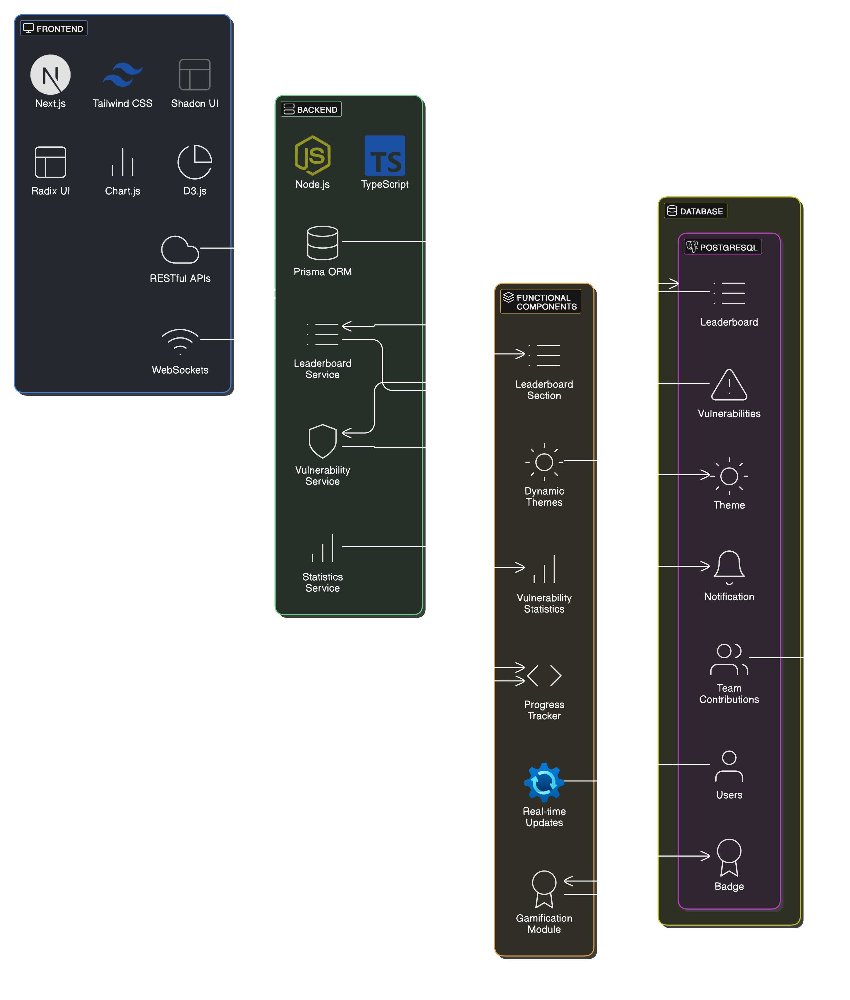

# VulnChamp 
### Overview 
The VulnChamp highlights the best workers of the weekend based on the vulnerabilities they find. It promotes healthy competition and recognizes outstanding performance within the team.

### Features
### 1. Leaderboard Section
#### Steps: 
1. Collect data on vulnerabilities found by each team member.
2. Rank team members based on the number of vulnerabilities found.
3. Display the leaderboard with the following details:
    - Worker name
    - Number of vulnerabilities found.
    - Severity breakdown (low, medium, high).
    - Short description of the vulnerability.
    - Date of the vulnerability discovery.
4. Award badges for "Top Hunter," "Runner-up," and "Honorable Mention."

### 2. Vulnerability Statistics
#### Steps:
1. Categorize vulnerabilities by type (e.g., SQL injection, XSS, etc.).
2. Aggregate severity data for all findings.
3. Create graphical representations:
    - Bar chart for vulnerability types.
    - Pie charts for severity distribution.
4. Add filtering options for specific time periods (e.g., last week, last month, etc.) and categories (e.g., SQL injection, XSS, etc.).

### 3. Weekly Highlights
#### Steps:
 1. Identify the notable vulnerabilities found by each team member during the week.
 2. Dedicated section for these highlights.
 3. Include the following details:
    - Worker name.
    - Vulnerability type.
    - Severity and impact.
    - Techniques used to identify or exploit it.
    - Short description of the vulnerability.
    - Date of the vulnerability discovery.
### 4. Progress Tracker
#### Steps:
1. Track individual performance over time.
2. Line graph to represent weekly or monthly progress.
3. Include cumulative points earned based on vulnerability severity.
4. Allow workers to view and analyze their own performance history.

### 5. Team Contributions
#### Steps:
1. Aggregate statistics for the entire team.
2. Display total vulnerabilities found.
3. Calculate averagge severity score for the team.
4. Highlight the team's overall improvement or trends.

### 6. Gamification
#### Steps:
1. A points system based on severity:
- Low: 1 point
- Medium: 3 points
- High: 5 points
2. Create badges and achievements for milestones.
3. Add weekly streak rewards for consistent performance.

### 7. Dynamic Themes
#### Steps:
1. A light and dark mode.
2. Dynamic color schemes based on the team's performance.
3. Customizable themes for each team member.

### 8. Real-time Updates
#### Steps:
1. Notify team members of new vulnerabilities.
2. Real-time updates on the leaderboard.

## System Architecture
### 1. Frontend
#### Steps:
1. Next.js  for the `frontend`.
2. Style components using `Tailwind CSS`, `Shadcn UI`, and `Radix UI`.
3. `Chart.js` and `D3.js` for creating interactive visualizations.
4. Components:
- Leaderboard
- Statistics
- Personal dashboard.

### 2. Backend
#### Steps:
1. `Node.js` with `TypeScript` for the `backend`.
2. `RESTful` APIs for:
- Fetching leaderboard data.
- Storing vulnerability findings.
- Serving statistics and progress data.
3. WebSockets for real-time updates.

### 3. Database
#### Steps:
1. `PostgreSQL` for the database.
2. Database schema using `Prisma ORM`:
```prisma
model users {
  id          String   @id @default(cuid())
  name        String
  email       String   @unique
  points      Int      @default(0)
  role        Role
  badges      String[]
  password    String
  createdAt   DateTime @default(now())
  updatedAt   DateTime @updatedAt
}

model vulnerabilities {
  id                String   @id @default(cuid())
  userId            String   @map("user_id")
  user              users    @relation(fields: [userId], references: [id])
  type              String
  severity          Severity
  date_found        DateTime
  description       String
  shortDescription  String
  createdAt         DateTime @default(now())
  updatedAt         DateTime @updatedAt
}

model leaderboard {
  id          String   @id @default(cuid())
  weekStart   DateTime
  weekEnd     DateTime
  userId      String   @map("user_id")
  user        users    @relation(fields: [userId], references: [id])
  rank        Int
  createdAt   DateTime @default(now())
  updatedAt   DateTime @updatedAt
}

model badge {
  id            String   @id @default(cuid())
  name          String
  description   String
  image         String
  pointsRequired Int
  createdAt     DateTime @default(now())
  updatedAt     DateTime @updatedAt
}

model notification {
  id        String   @id @default(cuid())
  userId    String   @map("user_id")
  user      users    @relation(fields: [userId], references: [id])
  type      String
  content   String
  read      Boolean  @default(false)
  createdAt DateTime @default(now())
}

model team_contributions {
  id                String   @id @default(cuid())
  teamName          String
  totalVulnerabilities Int
  averageSeverity   Float
  createdAt         DateTime @default(now())
  updatedAt         DateTime @updatedAt
}

model theme {
  id             String   @id @default(cuid())
  userId         String   @map("user_id")
  user           users    @relation(fields: [userId], references: [id])
  mode           String   @default("light")
  customSettings Json
  createdAt      DateTime @default(now())
  updatedAt      DateTime @updatedAt
}

enum Role {
  admin
  user
}

enum Severity {
  low
  medium
  high
}
```
### 4. Authentication
#### Steps:
1. JWT authentication for secure authentication.
2. Role-based access control.
   - Admin: Full control over the dashboard.
   - User: Limited to their data and rankings.
3. secure token storage and refresh mechanisms.

